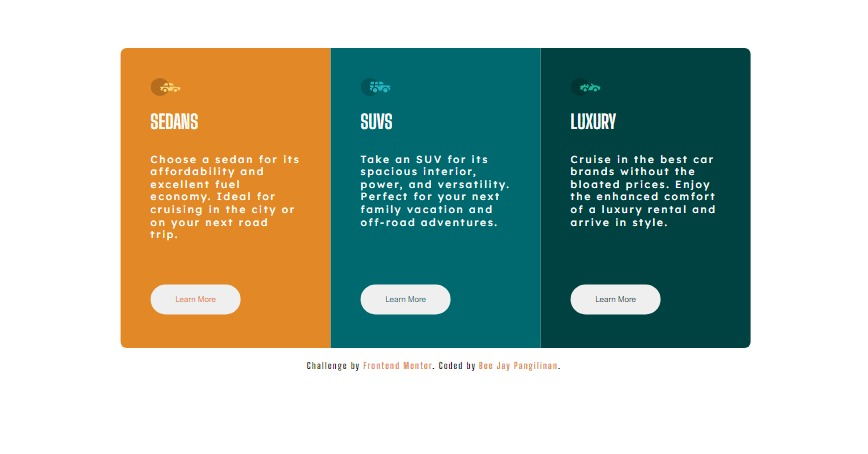

# Frontend Mentor - 3-column preview card component solution

This is a solution to the [3-column preview card component challenge on Frontend Mentor](https://www.frontendmentor.io/challenges/3column-preview-card-component-pH92eAR2-). Frontend Mentor challenges help you improve your coding skills by building realistic projects. 

## Table of contents

- [Overview](#overview)
  - [The challenge](#the-challenge)
  - [Screenshot](#screenshot)
  - [Links](#links)
- [My process](#my-process)
  - [Built with](#built-with)
  - [Useful resources](#useful-resources)
- [Author](#author)


## Overview

### The challenge

Users should be able to:

- View the optimal layout depending on their device's screen size
- See hover states for interactive elements

### Screenshot




### Links

- Solution URL: [https://www.frontendmentor.io/challenges/3column-preview-card-component-pH92eAR2-/hub/html-css-grid-PPabSKCG7](https://www.frontendmentor.io/challenges/3column-preview-card-component-pH92eAR2-/hub/html-css-grid-PPabSKCG7)
- Live Site URL: [https://bjmontillon.github.io/3columnpreview/](https://bjmontillon.github.io/3columnpreview/)

## My process

### Built with

- Semantic HTML5 markup
- CSS custom properties
- CSS Grid
- Mobile-first workflow


```html
<h1>Some HTML code I'm proud of</h1>
```
```css
.proud-of-this-css {
  color: papayawhip;
}
```
```js
const proudOfThisFunc = () => {
  console.log('🎉')
}
```
*


### Useful resources

- [w3school.com](https://www.w3school.com)


## Author

- Github - [@bjmontillon](https://wgithub.com/bjmontillon)
- Frontend Mentor - [@bjmontillon](https://www.frontendmentor.io/profile/@bjmontillon)
- Twitter - [@PangilinanBj](https://www.twitter.com/pangilinanbj)

